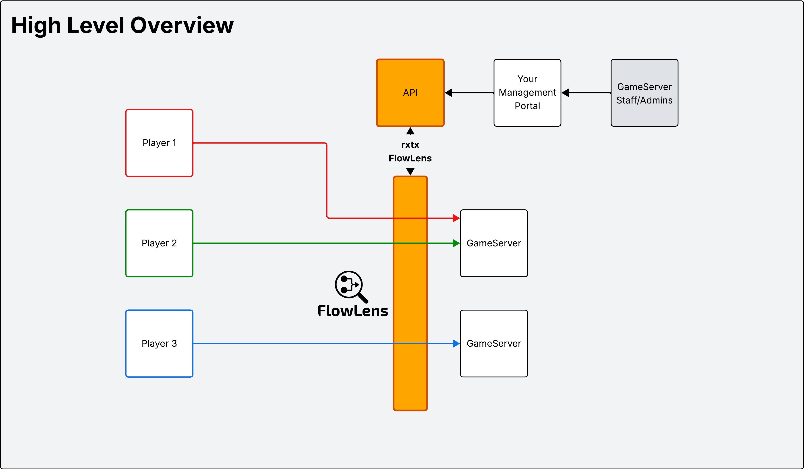
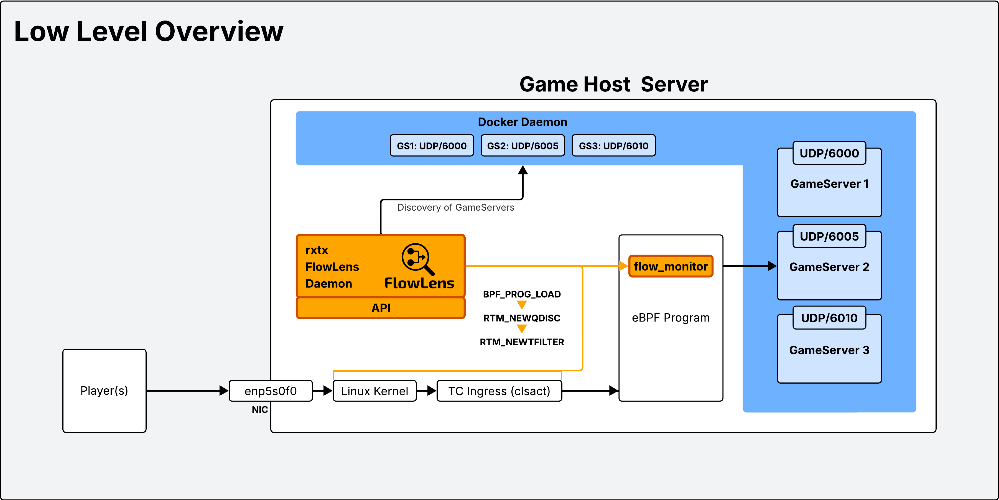

<p align="center">
  
</p>

---

eBPF-based network traffic monitor that estimates active players on game servers by tracking unique source IPs per destination port. Works with any game without game-specific integrations. Currently only Docker daemon is supported (tightly integrated) and only works for games that don't proxy users via a platform relay eg. Steam (SDR - Steam Datagram Relay), games that use these features should preferably have a specific implementation to gather player stats/connected over RCON or other protocols supported directly by the game developers.

## How It Works

1. Attaches eBPF TC hook to network interface
2. Tracks flows: `(src_ip, dst_port, proto) → (packets, bytes, last_seen)`
3. Discovers game server containers via Docker API
4. Maps destination ports to game server container hostnames
5. Counts unique IPs per port within activity window
6. Exposes metrics via JSON API and/or Prometheus

<p align="center">
  
</p>

<p align="center">
  
</p>

## Quick Start

```yaml
# docker-compose.yml
services:
  flowlens:
    image: ghcr.io/rxtx-hosting/flowlens:latest
    network_mode: host
    cap_add:
      - NET_ADMIN
      - BPF
      - PERFMON
    volumes:
      - /var/run/docker.sock:/var/run/docker.sock:ro
      - /etc/flowlens/config.yaml:/etc/flowlens/config.yaml:ro
    restart: unless-stopped
```

```bash
sudo mkdir -p /etc/flowlens
wget https://raw.githubusercontent.com/rxtx-hosting/flowlens/main/config.example.yaml
sudo mv config.example.yaml /etc/flowlens/config.yaml
docker compose up -d
```

## Pterodactyl/Pelican Integration

FlowLens works with Pterodactyl and Pelican game panels by filtering containers and extracting server information from Docker labels and environment variables.

**Configuration:**

```yaml
# Filter only Pterodactyl game server containers
docker_labels:
  Service: Pterodactyl

# Extract server UUID from environment variable
server_id_source: env:P_SERVER_UUID

# Get game port from environment variable
port_env_var: SERVER_PORT
```

**Label options:**
- `docker_labels`: Filters which containers to monitor. Common labels:
  - `Service: Pterodactyl` - Pterodactyl containers
  - `Service: Pelican` - Pelican containers (fork of Pterodactyl)
  - Empty `{}` - Monitor all containers

**Server ID options:**
- `server_id_source: env:P_SERVER_UUID` - Use Pterodactyl's server UUID (recommended)
- `server_id_source: hostname` - Use container hostname
- `server_id_source: name` - Use container name
- `server_id_source: label:your.label` - Use custom label

**Port detection:**
- `port_env_var: SERVER_PORT` - Standard game server port variable
- `port_env_var: GAME_PORT` - Alternative port variable
- Empty - Uses first published port

## Requirements

- Linux kernel 5.8+ with eBPF CO-RE support
- Docker with containerized game servers

**This application will NOT work on hosts without eBPF support.** Check with:
```bash
uname -r  # Must be >= 5.8

# Check BTF support (try one of these):
zgrep CONFIG_DEBUG_INFO_BTF /proc/config.gz 2>/dev/null || \
grep CONFIG_DEBUG_INFO_BTF /boot/config-$(uname -r) 2>/dev/null || \
ls /sys/kernel/btf/vmlinux
```

## Configuration

Copy the example and customize:

```bash
cp config.example.yaml config.yaml
# Edit config.yaml with your settings
```

Example `/etc/flowlens/config.yaml`:

```yaml
interface: eth0
ebpf_map_size: 100000
discovery_interval: 30s
metrics_interval: 30s
player_activity_threshold: 5m
min_packets_threshold: 50
min_bytes_threshold: 1000
server_addr: :8080
api_key: your-secret-key
prometheus_addr: :9090
log_level: info

docker_labels:
  app: gameserver

server_id_source: hostname
port_env_var: GAME_PORT
```

### Options

| Option | Description |
|--------|-------------|
| `interface` | Network interface to monitor. Use the physical interface where traffic enters the host (find with `ip addr show`), not the Docker bridge. |
| `ebpf_map_size` | Maximum concurrent flows in eBPF map. LRU eviction when full. |
| `discovery_interval` | How often to scan Docker for new/removed servers. |
| `metrics_interval` | How often to read flows and update player counts. |
| `player_activity_threshold` | Time window for active players. IPs inactive longer than this are excluded. |
| `min_packets_threshold` | Minimum packets required to count a flow as active player. Filters out query traffic. |
| `min_bytes_threshold` | Minimum bytes required to count a flow as active player. Filters out query traffic. |
| `server_addr` | JSON API server bind address. |
| `api_key` | Bearer token for JSON API authentication. |
| `prometheus_addr` | Prometheus metrics server bind address. Leave empty to disable. |
| `docker_labels` | Label filters for game server containers. Examples: `app: gameserver, env: prod` or `type: server, managed: true`. Empty `{}` monitors all containers. |
| `server_id_source` | How to extract server identifier. Options: `hostname` (default), `id`, `name`, `label:KEY`, `env:KEY` |
| `port_env_var` | Environment variable with game port (e.g., `GAME_PORT`, `SERVER_PORT`). Empty = use first published port. |
| `log_level` | Logging verbosity. Options: `debug`, `info` (default), `warn`, `error` |

## Logging

FlowLens uses structured logging with configurable levels. Set `log_level` in your config:

**info** (default) - Shows key events:
```
time=2025-11-13T02:58:03.943Z level=INFO msg="Starting FlowLens" interface=enp5s0f0
time=2025-11-13T02:58:03.951Z level=INFO msg="FlowLens started successfully"
time=2025-11-13T02:58:34.003Z level=INFO msg="Discovered game servers" count=7
time=2025-11-13T02:58:34.005Z level=INFO msg="Estimated players" servers=1
```

**debug** - Shows detailed flow filtering (useful for troubleshooting):
```yaml
log_level: debug
```

```
time=2025-11-13T02:58:34.003Z level=INFO msg="Discovered game servers" count=7
time=2025-11-13T02:58:34.005Z level=DEBUG msg="Flow filtered" ip=79.147.169.2 port=10520 packets=2 bytes=138 reason="below threshold"
time=2025-11-13T02:58:34.005Z level=DEBUG msg="Flow filtered" ip=162.254.196.79 port=58101 packets=1 bytes=66 reason="below threshold"
time=2025-11-13T02:58:34.005Z level=DEBUG msg="Flow filtered" ip=193.163.125.218 port=2174 packets=1 bytes=60 reason="below threshold"
time=2025-11-13T02:58:34.005Z level=DEBUG msg="Flow filtered" ip=1.1.1.1 port=34238 packets=1 bytes=220 reason="below threshold"
time=2025-11-13T02:58:34.005Z level=DEBUG msg="Flow passed" ip=192.0.2.1 port=10560 packets=1800 bytes=116161
time=2025-11-13T02:58:34.005Z level=DEBUG msg="Flow filtering complete" total=30 timeFiltered=0 thresholdFiltered=29 portFiltered=0 passed=1 minPackets=50 minBytes=1000
time=2025-11-13T02:58:34.005Z level=DEBUG msg="Server stats" uuid=f6a80377-2cdf-494b-ad51-3040aa95ef2e port=10560 players=1 totalBytes=116161
time=2025-11-13T02:58:34.005Z level=INFO msg="Estimated players" servers=1
```

Debug logs show which flows pass/fail the packet and byte thresholds, helping identify if legitimate players are being filtered or if thresholds need adjustment.

## JSON API

### GET /metrics/servers

Returns player stats for all discovered servers.

```bash
curl -H "Authorization: Bearer your-secret-key" http://localhost:8080/metrics/servers
```

### GET /metrics/servers/:id

Returns player stats for a specific server.

```bash
curl -H "Authorization: Bearer your-secret-key" http://localhost:8080/metrics/servers/550e8400-e29b-41d4-a716-446655440000
```

Response:
```json
{
  "server_id": "550e8400-e29b-41d4-a716-446655440000",
  "active_players": 12,
  "unique_ips": ["1.2.3.4", "5.6.7.8"],
  "sample_window_seconds": 300,
  "total_bytes": 1234567,
  "timestamp": "2025-11-12T12:00:00Z"
}
```

## Prometheus

Set `prometheus_addr` in config to enable Prometheus metrics endpoint. Runs on separate port from JSON API.

**Metrics:**

| Metric | Labels | Description |
|--------|--------|-------------|
| `flowlens_active_players` | `server_id` | Active player count per server |
| `flowlens_total_bytes` | `server_id` | Total bytes in sample window per server |

**Example scrape config:**
```yaml
scrape_configs:
  - job_name: 'flowlens'
    static_configs:
      - targets: ['localhost:9090']
```

**Query examples:**
```promql
# Total players across all servers
sum(flowlens_active_players)

# Players per server
flowlens_active_players{server_id="550e8400-e29b-41d4-a716-446655440000"}

# Total bandwidth
sum(rate(flowlens_total_bytes[5m]))
```

## Deploy

### Manual Binary

Download the latest release from [GitHub Releases](https://github.com/rxtx-hosting/flowlens/releases):

```bash
# Download latest release (amd64)
wget https://github.com/rxtx-hosting/flowlens/releases/latest/download/flowlens-linux-amd64

# Install
sudo mv flowlens-linux-amd64 /usr/local/bin/flowlens
sudo chmod +x /usr/local/bin/flowlens

# Create config
sudo mkdir -p /etc/flowlens
wget https://raw.githubusercontent.com/rxtx-hosting/flowlens/main/config.example.yaml
sudo mv config.example.yaml /etc/flowlens/config.yaml
# Edit /etc/flowlens/config.yaml with your settings

# Run
sudo flowlens --config=/etc/flowlens/config.yaml
```

### Docker

```bash
docker run -d \
  --name flowlens \
  --network host \
  --cap-add NET_ADMIN \
  --cap-add BPF \
  --cap-add PERFMON \
  -v /var/run/docker.sock:/var/run/docker.sock:ro \
  -v /etc/flowlens/config.yaml:/etc/flowlens/config.yaml:ro \
  ghcr.io/rxtx-hosting/flowlens:latest
```

Must use `--network host` to access physical interface. Must mount Docker socket for container discovery. It uses this socket to communicate to Docker and inspect container configurations to figure out the server_id and game port.

### Systemd Service

```bash
sudo make install
sudo systemctl enable --now flowlens
```

## Limitations

- Multiple players behind NAT share one IP (counted as one player) - This is also the same problem with relays, multiple players may come from the same relay IP so we can't detect if its more than 1 player
- Port scans may inflate counts (filter low packet/byte thresholds if needed) and even be detected as a fake player
- Most games run over UDP, there is no state nor any game specific logic, so it may never produce 100% accurate results

## Build from Source

**Requirements:**
- Go 1.24+
- clang, llvm
- libbpf-dev

Install build dependencies (Ubuntu/Debian):
```bash
sudo apt install -y clang llvm libbpf-dev
```

**Build:**
```bash
make deps      # Install Go dependencies and bpf2go
make generate  # Generate eBPF bindings from C code
make build     # Compile binary
```
